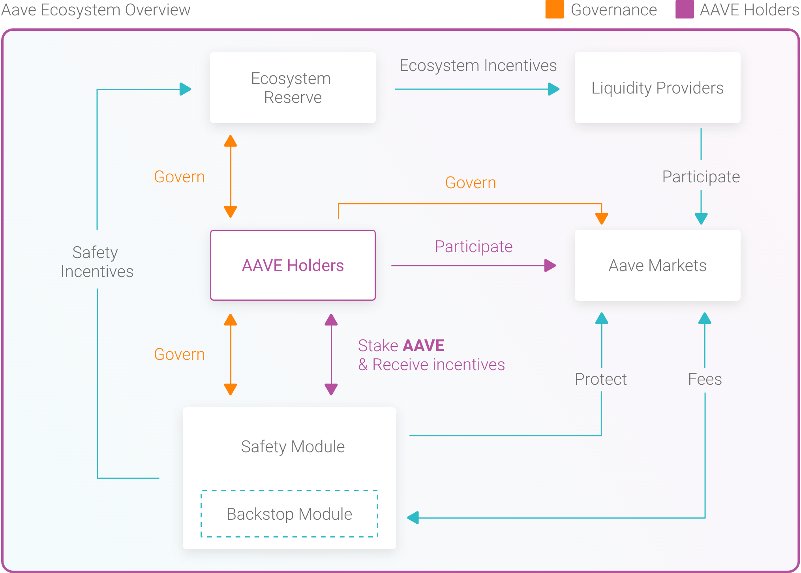

# aavenomics

## Introduction
The Aavenomics is a formalized path to the decentralization and autonomy of the Aave Protocol.

Acting as a catalyst for growth, Aavenomics introduces a future-proof framework leveraging financial incentives and multilevel governance to prioritize the safety and sustainability of Aave.

Formal documentation detailing the specific inner workings of the topics covered in this paper can be found in the Aavenomics paper.

## Token Migration
The migration to AAVE marks the first step in transitioning governance power from the Aave core team to AAVE token holders.

LEND will migrate to AAVE at a rate of 100 LEND per 1 AAVE, with the supply changing from 1.3B LEND to 16M AAVE. Of the 16M AAVE being issued, 13M AAVE tokens will be redeemed by LEND holders and 3M AAVE tokens will be held in an Aave Ecosystem Reserve for protocol incentives.

To start the migration, LEND will be used to vote on the Genesis Governance poll to deploy the smart contracts responsible for converting LEND to AAVE.

## Staking
Aave will be secured by a Safety Module (SM), a staking mechanism for AAVE tokens to act as insurance against Shortfall Events. Stakers earn AAVE as Safety Incentives (SI) along with a percentage of protocol fees.

Staking will feature plain AAVE alongside an AAVE/ETH pair. The latter will leverage Balancer to incentivize market liquidity and earn BAL along with trading fees.

Staked AAVE will be freely tradable after a cooldown period. All rewards accrue in real-time and are distributed as AAVE is withdrawn or transferred from the Safety Module.

## Incentives
The Aave Protocol will be able to distribute Ecosystem Incentives (EI) for supplying and borrowing assets from the protocol.

The community may also decide to allocate rewards to applications built on top of the Aave ecosystem. The decision to integrate new incentives will be performed through decentralized governance.

## Ecosystem Reserve
The Aave Ecosystem Reserve will act as a bootstrap fund allocated to protocol incentives as governance sees fit. AAVE holders will determine how the Ecosystem Reserve will be allocated between Safety and Ecosystem Incentives.

## Protocol Governance
Aavenomics are fueled by governance forums and ratified through onchain Aave Improvement Proposals (AIPs) using AAVE. This process looks to ensure extensive discussion is had on proposals prior to being pushed onchain. Both AAVE held in cold storage and AAVE staked via the Safety Module can be used to vote on AIPs or be delegated to Aave protocol politicians to vote on your behalf.

## Want to participate
We invite those eager to participate in the discussion surrounding any of the above concepts to join our governance forum or [Discord](https://discord.com/invite/CvKUrqM) as it’s readers such as yourself which will shape the Aave protocol of tomorrow.